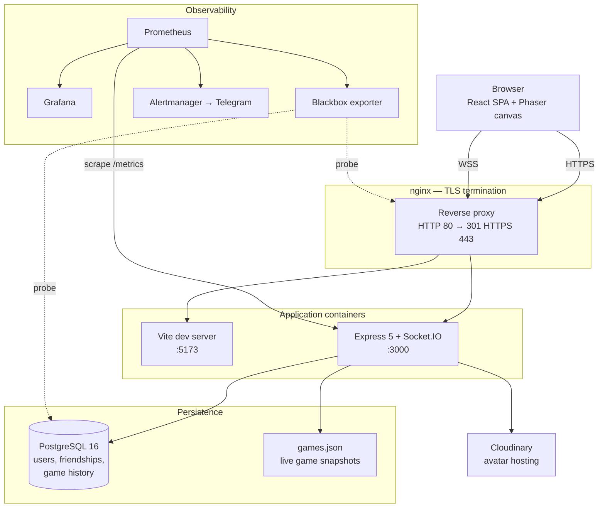
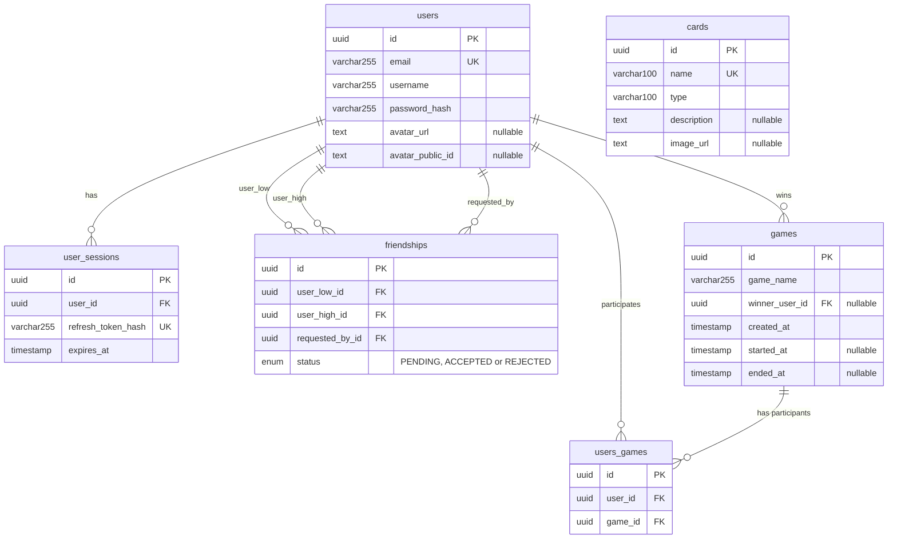

_This project has been created as part of the 42 curriculum by kvalerii, akovtune, rzvir, osivkov, iriadyns._

# Exploding CATs

A real-time, browser-based multiplayer card game for 2–5 players, built as the final
project of the 42 Common Core.

---

## Table of Contents

- [Description](#description)
- [Instructions](#instructions)
- [Team Information](#team-information)
- [Project Management](#project-management)
- [Technical Stack](#technical-stack)
- [Architecture Overview](#architecture-overview)
- [Database Schema](#database-schema)
- [Features List](#features-list)
- [Modules](#modules)
- [Individual Contributions](#individual-contributions)
- [API Documentation](#api-documentation)
- [Testing and Code Quality](#testing-and-code-quality)
- [Planned Work and Known Limitations](#planned-work-and-known-limitations)
- [Resources](#resources)
- [License and Credits](#license-and-credits)

---

## Description

**Exploding CATs** is a web application that lets registered players sit down at a virtual
table and play a full game of Exploding Kittens against each other, live, from separate
computers.

The goal of the project was to build a complete production-shaped web application as a
team: a real frontend, a real backend, a real database, real authentication, real-time
multiplayer, and the operational tooling to run and observe it — all deployable with a
single command.

The game itself is a turn-based card game. Players draw from a shared deck; whoever draws
an Exploding Kitten is eliminated unless they can play a Defuse card and secretly slip the
kitten back into the deck. Along the way players use Attack, Skip, Favor, Shuffle, See the
Future, Nope, and cat-card combos to sabotage each other. The last player alive wins.

### Key features

- **Live multiplayer for 2–5 players** on separate machines, synchronised over WebSockets
- **Authoritative server** — the full rule set runs as an [XState](https://stately.ai/docs)
  state machine on the backend, so clients cannot cheat by editing local state
- **Complete card set** — 56 cards across 13 types, including the Nope counter-window and
  two-of-a-kind / three-of-a-kind combos
- **Resilient sessions** — disconnects are detected, in-progress games survive a browser
  reload or a backend restart, and a stalled player is auto-played after 60 seconds
- **User accounts** — email/password signup with hashed passwords, JWT access tokens with
  rotating refresh tokens, editable profiles, and avatar upload
- **Social layer** — friend requests, friend lists, and live online/offline presence
- **Match history and statistics** — every finished game is persisted with its winner and
  participants, surfaced on each player's profile
- **Custom design system** — 28 reusable React components on a hand-built token palette
- **Full observability** — Prometheus metrics, provisioned Grafana dashboards, blackbox
  availability probing, and Telegram alerting
- **HTTPS everywhere** — nginx terminates TLS and redirects all plain HTTP traffic

---

## Instructions

### Prerequisites

| Requirement | Notes |
| --- | --- |
| **Docker Engine** + Compose plugin | Everything runs in containers |
| **GNU Make** | All workflows are wrapped in `Makefile` targets |
| **Git LFS** | Required. All images, sprites, and audio are stored via LFS — without it you will clone broken placeholder files |

Verify your toolchain:

```bash
docker --version
docker compose version
make --version
git lfs version
```

If Git LFS was not installed when you cloned:

```bash
git lfs install
git lfs pull
```

### Quick start

First, create the three `.env` files from their templates:

```bash
cp infra/env/.env.example infra/env/.env
cp backend/.env.example   backend/.env
cp frontend/.env.example  frontend/.env
```

Fill in the values (see [Configuration](#configuration) below), then bring the whole stack up
with one command:

```bash
make setup
```

This builds and starts every container and applies all database migrations. Docker Compose
installs the dependencies and waits for a healthy database before the backend starts, so
nothing else is required.

To create demo accounts you can log in with immediately, also run `make seed`.

Open `https://localhost:${NGINX_HTTPS_PORT}`, using the port you set in `infra/env/.env`.
The TLS certificate is self-signed, so your browser will warn you on first visit — accept it
to continue.

### Configuration

The templates ship with empty placeholder values, so every variable below needs filling in
before the stack will run. Every `make` target reads `infra/env/.env` directly and will fail
if it is missing.

**`infra/env/.env`** — Docker Compose and infrastructure

| Variable | Purpose |
| --- | --- |
| `COMPOSE_PROJECT_NAME` | Docker Compose project namespace |
| `NGINX_PORT` | Host port for HTTP (redirects to HTTPS) |
| `NGINX_HTTPS_PORT` | Host port for HTTPS — this is the one you browse to |
| `BACKEND_PORT` | Reserved; the backend is not published to the host |
| `POSTGRES_PORT` | Host port for PostgreSQL |
| `POSTGRES_DB`, `POSTGRES_USER`, `POSTGRES_PASSWORD` | Database credentials |
| `PROMETHEUS_PORT` | Host port for Prometheus |
| `GRAFANA_PORT` | Host port for Grafana |
| `GF_SECURITY_ADMIN_USER`, `GF_SECURITY_ADMIN_PASSWORD` | Grafana admin login |

**`backend/.env`** — application server

| Variable | Purpose |
| --- | --- |
| `NODE_ENV` | `development` or `production` |
| `PORT` | Backend listen port (`3000` inside the network) |
| `DATABASE_URL` | Postgres connection string. Inside Docker the host must be `postgres`, not `localhost` |
| `FRONTEND_URL` | Allowed CORS origin |
| `JWT_ACCESS_SECRET`, `JWT_REFRESH_SECRET` | Separate signing secrets for the two token types |
| `JWT_ACCESS_EXPIRES_IN` | Access token lifetime (e.g. `15m`) |
| `JWT_REFRESH_EXPIRES_IN` | Refresh token lifetime (e.g. `7d`) |
| `GAME_PERSISTENCE_FILE_PATH` | Where live game snapshots are written (e.g. `./data/games.json`) |
| `CLOUDINARY_CLOUD_NAME`, `CLOUDINARY_API_KEY`, `CLOUDINARY_API_SECRET` | Avatar image hosting |

**`frontend/.env`** — browser client

| Variable | Purpose |
| --- | --- |
| `VITE_API_BASE_URL` | Base URL of the REST API (e.g. `https://localhost:8443/api`) |
| `VITE_WS_BASE_URL` | Base URL of the Socket.IO endpoint |

Real `.env` files are gitignored; only the `.env.example` templates are tracked. Telegram
alerting credentials live in `infra/secrets/` as Docker secrets and are gitignored too.

### Running the stages individually

`make setup` is a thin wrapper. To run its stages yourself, or to debug one of them:

```bash
make build          # build images and start every container
make prisma-deploy  # apply existing database migrations
make seed           # insert demo users and card reference data
make logs-backend   # follow backend logs
```

### How dependencies are installed

You never install dependencies by hand. A dedicated `libraries` service runs
`pnpm install --frozen-lockfile` into shared Docker volumes, and both the backend and the
frontend declare a dependency on it completing successfully — alongside a healthy
PostgreSQL — before they start. Every `make build` or `make up` re-runs that install.

### Where things are

Substitute your own ports from `infra/env/.env`.

| Service | URL |
| --- | --- |
| Application | `https://localhost:${NGINX_HTTPS_PORT}` |
| REST API docs (Swagger UI) | `https://localhost:${NGINX_HTTPS_PORT}/api/docs/rest-api/` |
| WebSocket docs (AsyncAPI) | `https://localhost:${NGINX_HTTPS_PORT}/api/docs/sockets` |
| Grafana | `http://localhost:${GRAFANA_PORT}` |
| Prometheus | `http://localhost:${PROMETHEUS_PORT}` |

The seed script creates demo accounts with the password `Password123!`. It refuses to run
when `NODE_ENV=production`.

### Daily workflow

```bash
make up             # start an already-initialised project
make logs-backend   # follow backend logs
make down           # stop everything
```

After changing a Dockerfile or adding a dependency, re-run `make build` — it rebuilds the
images and reinstalls dependencies. After changing the Prisma schema, run
`make prisma-migrate` and enter a migration name when prompted.

### Useful commands

Run `make help` for the full self-documenting list. The most-used targets:

| Category | Targets |
| --- | --- |
| Lifecycle | `setup`, `up`, `build`, `down`, `re`, `ps`, `clean` |
| Logs | `logs`, `logs-backend`, `logs-frontend`, `logs-nginx`, `logs-postgres` |
| Shells | `backend-shell`, `frontend-shell`, `db-shell` |
| Database | `prisma-generate`, `prisma-migrate`, `prisma-deploy`, `prisma-reset`, `seed` |
| Tests | `test-backend`, `test-orm`, `test-attack` |
| Quality | `format-check`, `lint-check`, `typecheck`, `code-quality-check`, `code-quality-fix` |
| Monitoring | `alerts-up`, `alerts-down`, `alerts-status` |

### Troubleshooting

| Symptom | Fix |
| --- | --- |
| Backend cannot reach the database | `DATABASE_URL` in `backend/.env` must use host `postgres`, not `localhost` |
| `Module not found` in a container | Re-run `make build` — this re-runs the dependency install into the shared volumes |
| Env change had no effect | `make down && make up` |
| Images render as text placeholders | Git LFS was not installed at clone time: `git lfs install && git lfs pull` |
| Browser refuses to connect | The certificate is self-signed; accept the warning, and make sure you are on `https://`, not `http://` |

---

## Team Information

The project was built by five students. Each member holds one specialised role plus the
Developer role, which everyone shares.

| Member | Login | Role(s) |
| --- | --- | --- |
| Andrii Kovtunets | `akovtune` | Product Owner + Developer |
| Valeriia Krasnianska | `kvalerii` | Project Manager / Scrum Master + Developer |
| Roman Zvir | `rzvir` | Technical Lead / Architect + Developer |
| Oleksandr Sivkov | `osivkov` | DevOps Engineer + Developer |
| Ivan Riadynskyi | `iriadyns` | Database Engineer + Developer |

### Responsibilities

**Andrii Kovtunets — Product Owner**
Defined the product vision and decided that the team would build a card game rather than
another Pong clone. Maintained the backlog, prioritised which cards and mechanics shipped
in which order, validated completed work against the game rules, and represented the
project to evaluators and peers.

**Valeriia Krasnianska — Project Manager / Scrum Master**
Organised the weekly planning and sync meetings, tracked progress against deadlines,
distributed tasks across the team, and unblocked members when a feature spanned several
people's areas. Also acted as the team's designer: produced the full visual design in
Figma — layouts, mockups, and screen flows for every page — which the implemented
interface follows.

**Roman Zvir — Technical Lead / Architect**
Defined the technical architecture: the authoritative-server model, the choice of XState
for the rule engine, the socket event layer, and the split into shared workspace packages.
Made the stack decisions, reviewed critical changes, and set the branching and code-review
conventions.

**Oleksandr Sivkov — DevOps Engineer**
Owned everything outside the application code: Docker Compose topology, nginx and TLS,
the Makefile, and the complete monitoring and alerting stack. Also owned the
authentication subsystem end to end.

**Ivan Riadynskyi — Database Engineer**
Designed and owned the relational schema, wrote every migration, and built the seed
tooling, deciding how game results and relationships are persisted. Beyond the database
itself, built the backend service layer for the users, profile, and friends APIs, the
game-history persistence that records every finished match, and the lobby and reconnection
features that sit on top of them.

**All members — Developers**
Every member wrote feature code, reviewed pull requests, tested their own work, and
documented it.

---

## Project Management

### How the work was organised

Each person took a whole feature and built it from top to bottom, instead of one person
doing all the backend and another doing all the frontend. For example, whoever built the
Nope card wrote its game rules, its backend handler, its shared types, and the button the
player clicks. This meant nobody had to wait for someone else to finish a layer before
their feature could work.

Some parts of the project belong everywhere at once and could not be split this way, so
each of those got a single owner: Ivan owned the database, Oleksandr owned the
infrastructure and monitoring, and Roman owned the socket architecture.

Work was split into small branches that could be reviewed on their own. Branch names and
commit messages follow the conventional-commit style, for example
`feat(backend): add PLAY_NOPE event handler for game listeners`.

### Meetings

Weekly team syncs, alternating between online and in person, covering progress, blockers,
and the next slice of work. Ad-hoc calls were used for design decisions that needed more
than two people.

### Tools

| Purpose | Tool |
| --- | --- |
| Task tracking | GitHub Issues, Trello |
| Source control and review | GitHub pull requests |
| Merge automation | Mergify — blocks rebasing stacked branches onto a non-`main` base |
| Continuous integration | GitHub Actions (`.github/workflows/code-quality.yml`) |
| Team chat | Slack |
| Meetings | Google Meet |

### Code review

**Every pull request required approval from at least two reviewers before merging.** This
was the team's main quality gate, and it doubled as knowledge sharing — because reviewers
came from outside the feature's area, no subsystem ended up understood by only one person.

The team worked with stacked branches, rebasing feature branches onto `main` rather than
creating merge commits. This keeps the history linear and readable, and is why the
repository has almost no merge commits. Mergify enforces that stacked branches are not
accidentally rebased onto the wrong base.

CI runs on every pull request as a three-job matrix: formatting check, lint, and type
check, across the whole workspace.

---

## Technical Stack

### Frontend

| Technology | Version | Role |
| --- | --- | --- |
| React | 19 | UI framework |
| TypeScript | 5.9 | Language, in strict mode |
| Vite | 8 | Build tool and dev server |
| React Router | 7 | Client-side routing |
| Phaser | 3.90 | 2D game canvas for the table itself |
| XState | 5.31 | State machines |
| Socket.IO client | 4.8 | Real-time transport |
| Axios | 1.14 | HTTP client with auth interceptors |
| React Hook Form + Zod | 7.72 / 4.3 | Form state and validation |
| CSS Modules + `modern-normalize` | — | Scoped styling and reset |
| React Toastify | 11 | Toast notifications |

### Backend

| Technology | Version | Role |
| --- | --- | --- |
| Node.js | 24 | Runtime |
| Express | 5 | HTTP framework |
| TypeScript | 5.9 | Language, in strict mode |
| Socket.IO | 4.8 | WebSocket server |
| Prisma | 7 | ORM and migration tool |
| Zod | 4.3 | Request and socket payload validation |
| jsonwebtoken | 9 | Access and refresh tokens |
| bcrypt | 6 | Password hashing |
| express-rate-limit | 8 | Global and login rate limiting |
| Multer + Cloudinary | 2.1 / 2.10 | Avatar upload and hosting |
| prom-client | 15 | Prometheus instrumentation |
| swagger-ui-express | 5 | Serves the OpenAPI spec |
| Pino | 11 | Structured request logging |

### Shared packages

The repository is a pnpm workspace. Two packages are shared between frontend and backend:

| Package | Contents |
| --- | --- |
| `@exploding-cats/game-core` | The XState game machine, card definitions, rules constants, deck utilities |
| `@exploding-cats/contracts` | Zod schemas, REST request/response types, and socket event name constants |

### Database

**PostgreSQL 16**, accessed through **Prisma 7**.

### Infrastructure

| Component | Image | Role |
| --- | --- | --- |
| nginx | `nginx:alpine` | TLS termination, reverse proxy, WebSocket upgrade |
| PostgreSQL | `postgres:16-alpine` | Primary datastore |
| Prometheus | `prom/prometheus:v2.55.1` | Metrics collection |
| Grafana | `grafana/grafana:11.3.1` | Dashboards |
| Blackbox exporter | `prom/blackbox-exporter:v0.28.0` | Availability probing |
| Alertmanager | `prom/alertmanager:v0.32.1` | Telegram alert delivery (opt-in profile) |

### Justification for major technical choices

**Why PostgreSQL.** Two practical reasons. It is the most widely used open-source
relational database, so documentation and answers are easy to find, and Ivan — who owned
the database — had already worked with it, which meant the team did not have to learn a new
engine alongside everything else that was new in this project. The data is also genuinely
relational: users own sessions, friendships join two users, and games join many users, so
foreign keys and cascade rules let the database enforce integrity instead of the
application. Postgres' `ON DELETE` semantics let us encode deliberate policies — deleting a
user cascades their sessions and friendships, but a finished game keeps its record and
merely nulls the winner.

**Why Prisma as the ORM.** Prisma generates types directly from the schema, so a column
rename becomes a compile error rather than a runtime surprise — which matters in a strict
TypeScript codebase touched by five people. Its migration workflow gives a reviewable,
version-controlled history of every schema change.

**Why Express for the backend.** The team wanted a minimal, well-understood HTTP layer
with no framework-specific abstractions to learn, because the genuinely hard part of this
project is the game engine, not the routing. Express 5 adds native async error handling,
which removes most of the boilerplate that made Express 4 awkward with `async`/`await`.

**Why React over Svelte.** The project actually started in Svelte, and the team switched
early. Some members already had React experience while nobody had shipped anything in
Svelte, which has a steeper learning curve. React also has far more documentation and
community answers to fall back on — which matters when several other technologies in the
stack were already new to the team — and it integrated cleanly with Phaser, since we only
needed React to mount the canvas and then stay out of its way.

**Why XState for the game rules.** This is the most consequential decision in the project.
A card game is a state machine: there are legal moves in each phase and everything else
must be rejected. Encoding those rules as explicit states, guards, and transitions makes
the legal move set *provable* rather than a sprawl of conditionals — and because the same
machine can be visualised in the Stately editor, the whole team could review the rules
without reading the code. It also gave the authoritative-server property for free: the
machine runs on the backend, clients only send events, and an event that isn't legal in
the current state simply does not transition.

**Why Phaser over PixiJS.** Pixi is a rendering library: it draws sprites fast but leaves
scenes, input, physics, asset loading, and the game loop to you. Phaser is a full game
engine with all of that built in. The team deliberately chose the game engine, because part
of the point of this project was to work with real game-development tooling rather than to
hand-roll a game loop around a renderer. React keeps routing, authentication, the lobby,
and profiles; Phaser owns the table; a small event bus bridges them.

**Why CSS Modules instead of a utility framework.** The subject asks for a custom design
system with its own palette and typography. Building that on top of a framework's tokens
would have meant fighting its defaults. Plain CSS Modules with custom properties gave full
control over the palette while keeping styles scoped per component.

**Why a shared `contracts` package.** Frontend and backend must agree on every socket
event name and payload shape. Defining them once, as Zod schemas the backend validates
with and TypeScript types the frontend consumes, makes a mismatch a compile error instead
of a bug discovered mid-game.

---

## Architecture Overview



### How a game actually runs

Every game is an **XState actor living in backend memory**. The client never computes game
state; it sends intent (`draw-card`, `play-card`, `play-nope`) and renders what the server
broadcasts back. If an event is not legal in the machine's current state, the transition
simply does not happen and an error event is returned to the caller.

The socket layer is deliberately thin. A broadcaster subscribes to the machine's outbound
events and re-emits them over Socket.IO without interpreting them, which keeps all rule
knowledge in one place.

Two rooms are used per socket: the `gameId` room carries all game traffic, and a room
named after the `userId` carries presence and private messages. Online status is *derived*
from whether that room has any members, rather than stored in the database — so it cannot
go stale after a crash.

Because live games only exist in memory, all machine snapshots are serialised to a JSON
file every five seconds and on shutdown, then rehydrated at boot. Finished games are a
different concern and are written to PostgreSQL as permanent history.

---

## Database Schema



### Tables

**`users`** — one row per account.

| Column | Type | Constraints |
| --- | --- | --- |
| `id` | `uuid` | Primary key, generated |
| `email` | `varchar(255)` | Unique, stored lowercase |
| `username` | `varchar(255)` | Not unique — display names may repeat |
| `password_hash` | `varchar(255)` | bcrypt, cost factor 10 |
| `avatar_url` | `text` | Nullable; Cloudinary secure URL |
| `avatar_public_id` | `text` | Nullable; Cloudinary handle for the asset |

**`user_sessions`** — one row per active refresh token.

| Column | Type | Constraints |
| --- | --- | --- |
| `id` | `uuid` | Primary key; this value is the `sessionId` claim inside the refresh JWT |
| `user_id` | `uuid` | FK → `users.id`, `ON DELETE CASCADE`, indexed |
| `refresh_token_hash` | `varchar(255)` | Unique; SHA-256 of the token, never the token itself |
| `expires_at` | `timestamp` | Absolute expiry |

Storing only the hash means a database leak does not yield usable refresh tokens. Because
the hash is rotated on every refresh, replaying an already-used token fails.

**`friendships`** — one row per relationship between two users.

| Column | Type | Constraints |
| --- | --- | --- |
| `id` | `uuid` | Primary key |
| `user_low_id` | `uuid` | FK → `users.id`, `ON DELETE CASCADE` |
| `user_high_id` | `uuid` | FK → `users.id`, `ON DELETE CASCADE` |
| `requested_by_id` | `uuid` | FK → `users.id`, `ON DELETE CASCADE`, indexed |
| `status` | `friendship_status` | `PENDING` / `ACCEPTED` / `REJECTED` |

A friendship is symmetric, so the pair is stored **canonically**: the two user IDs are
sorted and the smaller always goes in `user_low_id`. Combined with the unique constraint
on `(user_low_id, user_high_id)`, this makes a duplicate friendship impossible at the
database level regardless of who sends the request. `requested_by_id` preserves direction
so the UI can distinguish an incoming request from an outgoing one.

**`games`** — one row per finished or in-progress game recorded for history.

| Column | Type | Constraints |
| --- | --- | --- |
| `id` | `uuid` | Primary key; matches the in-memory game ID |
| `game_name` | `varchar(255)` | Table name chosen at creation |
| `winner_user_id` | `uuid` | Nullable FK → `users.id`, `ON DELETE SET NULL`, indexed |
| `created_at` | `timestamp` | Defaults to now |
| `started_at` | `timestamp` | Nullable until the game begins |
| `ended_at` | `timestamp` | Nullable until the game ends |

`ON DELETE SET NULL` is deliberate: deleting an account must not erase the match history of
everyone who played against them.

**`users_games`** — join table linking participants to games.

| Column | Type | Constraints |
| --- | --- | --- |
| `id` | `uuid` | Primary key |
| `user_id` | `uuid` | FK → `users.id`, `ON DELETE RESTRICT` |
| `game_id` | `uuid` | FK → `games.id`, `ON DELETE CASCADE`, indexed |

Unique on `(user_id, game_id)` so a player cannot be recorded twice in the same game.

**`cards`** — reference data for the card catalogue, populated by the seed script. Note
that the running game engine does not read this table; it uses the card definitions in
`packages/game/src/constants/cards.json`, which are shared with the frontend. The table
exists as a queryable reference and is documented here for completeness rather than
presented as part of the live game path.

### Migration history

Eight migrations in `backend/prisma/migrations/`, each a reviewed schema change:

| Migration | Change |
| --- | --- |
| `init` | Initial schema |
| `remove_players_json_and_sequence_number` | Dropped denormalised columns in favour of relations |
| `remove_game_moves_and_move_card` | Removed per-move tables once state moved in-memory |
| `friendship_status_and_user_presence` | Added the friendship status enum |
| `add_game_name_to_games` | Named tables in the lobby |
| `remove_username_unique` | Allowed duplicate display names |
| `add_avatar_public_id` | Tracked the Cloudinary asset handle |
| `remove_is_online_and_last_seen_at` | Moved presence out of the database and into socket rooms |

---

## Features List

### Authentication and accounts

| Feature | Description | Contributors |
| --- | --- | --- |
| Registration | Email/password signup with strict validation: 8–128 characters, upper and lower case, digit, special character. Passwords hashed with bcrypt | Oleksandr, Valeriia |
| Login and sessions | JWT access token plus an httpOnly refresh cookie backed by a database session row | Oleksandr |
| Refresh token rotation | Every refresh issues a new token and invalidates the old hash; expired sessions are garbage-collected | Oleksandr |
| Logout | Deletes the server-side session and clears the cookie | Oleksandr |
| Profile editing | Change username, email, or password; changing a password requires the current one | Valeriia, Ivan |
| Avatar upload | Client and server validated (2 MB, JPEG/PNG/WebP), streamed to Cloudinary | Valeriia |
| Route guards | `PrivateRoute` protects authenticated pages, `AuthRoute` redirects logged-in users away from login | Oleksandr |
| Transparent token refresh | Axios interceptors refresh expired access tokens and serialise concurrent attempts into one request | Oleksandr |

### Social

| Feature | Description | Contributors |
| --- | --- | --- |
| Friend requests | Send, accept, reject, and cancel requests; symmetric pairs stored canonically | Valeriia, Ivan |
| Friends list | Filterable by accepted, incoming, or all | Valeriia, Ivan |
| User search | Look up players by exact username | Valeriia, Ivan |
| Public profiles | View any player's profile, stats, and friends | Valeriia, Roman |
| Leaderboard | Ranked standings for every player by games played and wins, with its own page and navigation entry | Valeriia |
| Live presence | Online/offline status pushed to friends over WebSockets, derived from socket rooms | Roman |

### Lobby

| Feature | Description | Contributors |
| --- | --- | --- |
| Lobby page | Browse open tables with player slots and avatars | Roman, Ivan |
| Create a table | Name a table and set its player limit (2–5) | Ivan |
| Join a table | Join from the list or by table ID, with validation | Ivan, Oleksandr |
| Real-time lobby | Tables appear and disappear for all clients without refreshing | Ivan |
| Active-game prompt | A persistent banner offers to rejoin a game already in progress | Ivan |
| One active game per user | The server refuses to seat a player at two tables | Ivan |

### Gameplay

| Feature | Description | Contributors |
| --- | --- | --- |
| Game rules engine | The complete rule set as an XState machine with 21 states, shared by frontend and backend | Roman, Andrii, Valeriia |
| Card definitions | 56 cards across 13 types with per-card behaviour flags | Roman |
| Waiting room | Seat assignment, ready confirmation, and a 10-second start countdown | Roman |
| Dealing | 7 cards plus one Defuse per player; kittens and spare Defuses shuffled back | Andrii |
| Draw and turn flow | Turn rotation, deck depletion, and turn counting | Roman, Valeriia |
| Exploding Kitten and Defuse | Draw resolution, defuse prompt with timeout, secret kitten reinsertion | Valeriia |
| Attack | Forces the next player to take extra turns | Roman, Oleksandr |
| Skip | Ends a turn without drawing | Roman |
| Shuffle | Randomises the deck | Andrii |
| See the Future | Privately reveals the top three cards to the player only | Andrii |
| Favor | Target a player and force them to hand over a card of their choosing | Andrii |
| Nope | A timed counter-window during which any player may cancel the last action, including another Nope | Roman |
| Card combos | Two-of-a-kind steals a random card; three-of-a-kind lets you name the card you want | Oleksandr, Ivan |
| Elimination and game over | Player removal, last-player-standing detection, and the game over screen | Valeriia |
| Kitten risk indicator | Live probability that the next draw is an Exploding Kitten | Valeriia |
| Card animations | Draw, discard, steal, and favor card-flight tweens | Roman, Valeriia |

### Real-time and resilience

| Feature | Description | Contributors |
| --- | --- | --- |
| WebSocket layer | Authenticated Socket.IO connections with room-scoped broadcasting and acknowledgements | Roman |
| Disconnect detection | Other players are told immediately when someone drops | Roman |
| Reconnection | Rejoining rebuilds full game state — hand, turn, deck size, discard pile, countdown, pending actions. See the note below | Ivan, Roman, Andrii, Valeriia, Oleksandr |
| Auto-play | If the active player is offline for 60 seconds, the server draws for them so the game continues | Roman |
| Crash recovery | Live game snapshots are written to disk every 5 seconds and restored on restart | Valeriia, Roman, Andrii |
| Game history persistence | Finished games are written to PostgreSQL with winner and participants | Ivan |
| Game cleanup | Finished games are torn down 60 seconds after they end | Roman |

**On reconnection:** this was the most collaborative feature in the project and no single
person owns it. Ivan built the core `reconnectGame` service and the rejoin modal; Roman
built the disconnect/reconnect event layer and the waiting-room and game-room state
restoration; Andrii restored the game UI; Valeriia added join/reconnect status checks and
player-status rendering; Oleksandr exposed attack state in the reconnect payload.

### Design system and pages

| Feature | Description | Contributors |
| --- | --- | --- |
| Visual design (Figma) | Layouts, mockups, and screen flows for every page, produced before implementation | Valeriia (design), Andrii (ideas and assets) |
| Component library | 28 reusable, barrel-exported React components | Andrii, Roman, Valeriia |
| Design tokens | 21 CSS custom properties for colour, plus four typefaces and two SVG icon sprites | Andrii, Roman |
| Responsive layout | Four breakpoints with per-breakpoint art, mobile navigation, and reduced-motion support | Andrii, Roman, Valeriia |
| Home, Rules, About pages | Landing page, rules with video and downloadable PDF, team page | Andrii |
| Privacy Policy and Terms | Full legal pages covering data collected, third parties, and account rules | Roman |

### Observability

| Feature | Description | Contributors |
| --- | --- | --- |
| Application metrics | Request counts, latency histograms, and per-operation success/failure counters | Oleksandr |
| Prometheus | 5-second scrape of the backend plus blackbox probes | Oleksandr |
| Grafana | Provisioned datasource and a Backend Metrics dashboard | Oleksandr |
| Availability probing | HTTP, HTTPS, and TCP probes against nginx, frontend, backend, and Postgres | Oleksandr |
| Alerting | `ServiceUnavailable` rule routed to Telegram with recovery notifications | Oleksandr |

---

## Modules

**Total: 22 points** — 8 Major modules (16 points) and 6 Minor modules (6 points), against
a requirement of 14.

| # | Module | Type | Pts | Contributors |
| --- | --- | --- | --- | --- |
| 1 | Use a framework for both the frontend and backend | Major | 2 | Andrii, Roman |
| 2 | A public API with rate limiting, documentation, and 5+ endpoints | Major | 2 | Valeriia, Oleksandr, Ivan |
| 3 | Standard user management and authentication | Major | 2 | Oleksandr, Valeriia |
| 4 | Real-time features using WebSockets | Major | 2 | Roman, Andrii |
| 5 | A complete web-based game where users play against each other | Major | 2 | All |
| 6 | Remote players on separate computers | Major | 2 | All |
| 7 | Multiplayer game (more than two players) | Major | 2 | All |
| 8 | Monitoring system with Prometheus and Grafana | Major | 2 | Oleksandr |
| 9 | Use a frontend framework | Minor | 1 | Andrii |
| 10 | Use a backend framework | Minor | 1 | Oleksandr, Valeriia |
| 11 | Use an ORM for the database | Minor | 1 | Ivan |
| 12 | Custom-made design system with reusable components | Minor | 1 | Andrii, Roman, Valeriia |
| 13 | Game statistics and match history | Minor | 1 | Ivan, Valeriia |
| 14 | Support for additional browsers | Minor | 1 | All |

**Point calculation:** 8 Major × 2 = 16, 6 Minor × 1 = 6. **16 + 6 = 22 points.**

### 1. Framework for both frontend and backend — Major, 2 pts

**Why:** Building a project of this size on vanilla DOM manipulation and a bare Node HTTP
server would have consumed the entire timeline in plumbing.

**How:** The frontend is a React 19 single-page application built with Vite, using React
Router for navigation and React Hook Form for forms. The backend is an Express 5
application with a layered routes → controllers → services → data structure, custom
router factories that apply authentication to whole route groups, and centralised error
middleware.

### 2. Public API — Major, 2 pts

**Why:** A documented HTTP API forced clean separation between the client and the server,
and made the backend independently testable.

**How:** 22 application endpoints across five resource groups (`/auth`, `/users`, `/me`,
`/me/friends`, `/games`) covering `GET`, `POST`, `PATCH`, and `DELETE`. Access is secured
with JWT bearer tokens issued at login and validated by middleware on every protected
route. Rate limiting is applied globally per client IP and, more strictly, on the login
route, keyed on IP *and* account so that a shared IP does not lock out unrelated users and
successful logins are not counted against the budget. The full specification is written in
OpenAPI 3.0.3, split across per-domain files, and served as interactive Swagger UI at
`/api/docs/rest-api/`. The WebSocket API is documented separately in AsyncAPI 3.0.0.

### 3. Standard user management and authentication — Major, 2 pts

**Why:** Required for any multiplayer game with persistent identity.

**How:** Registration validates and normalises input on both client and server, then hashes
the password with bcrypt at cost 10. Login issues a short-lived access token and a
long-lived refresh token; only a SHA-256 hash of the refresh token is stored, and it is
rotated on every use so a stolen token stops working as soon as the legitimate client
refreshes. Users can edit their profile and upload an avatar, with a default shown when
none is set. Friends can be added and removed, and their online status is live. Every user
has a profile page showing their information, statistics, and match history.

### 4. Real-time features using WebSockets — Major, 2 pts

**Why:** A live card game is not possible over request/response alone.

**How:** Socket.IO with JWT authentication at handshake time. 16 client-to-server events,
35 broadcast server events, 12 private events, and 16 typed error events, all defined once
in the shared contracts package and validated with Zod on arrival. Broadcasting is
room-scoped so a game's traffic reaches only its participants. Connection and disconnection
are handled gracefully: presence is derived from room membership, disconnects notify the
table, and reconnecting rebuilds the full client state.

### 5. Complete web-based game — Major, 2 pts

**Why:** The core of the project.

**How:** A full implementation of Exploding Kittens with clear rules and an unambiguous
win condition — the last player alive wins. The rule set is an XState machine with 21
states covering turn flow, the Nope counter-window, defuse handling, kitten insertion,
favor requests, combo resolution, and elimination. Rendering is a 2D Phaser scene with
drag-and-drop cards, seat layout, and animation.

### 6. Remote players — Major, 2 pts

**Why:** Players must be able to play from different machines.

**How:** All state is server-side, so any number of physically separate clients stay
consistent. Latency is absorbed because clients render server events rather than predicting
outcomes. Disconnections are detected and broadcast, a 60-second auto-play keeps a game
from stalling on an absent player, and full reconnection logic restores a returning player
to the exact game state.

### 7. Multiplayer, more than two players — Major, 2 pts

**Why:** Exploding Kittens is at its best with a full table.

**How:** Tables support 2 to 5 players, enforced at creation, at join time, and in the
machine's dealing logic (the deck is built with `players − 1` kittens so exactly one player
survives). Turn order is randomised at start and rotates fairly, elimination removes a
player without disturbing the rotation, and every action is synchronised to all clients
through room broadcasts.

### 8. Monitoring with Prometheus and Grafana — Major, 2 pts

**Why:** A system that cannot be observed cannot be operated.

**How:** The backend exposes Prometheus metrics on a dedicated registry: default Node
process metrics, a request counter and latency histogram labelled by method, templated
route, and status code, and a business-operation counter tracking success and failure for
ten named operations. Prometheus scrapes every 5 seconds. A blackbox exporter probes nginx
over HTTPS, the frontend, the backend, and Postgres over TCP. Grafana is provisioned as
code — datasource, dashboard provider, and a Backend Metrics dashboard — and secured with
admin credentials from the environment. An alerting rule fires when any probe fails for 30
seconds, routed through Alertmanager to Telegram with recovery notifications. The metrics
endpoint is deliberately blocked at the nginx edge so it is reachable only from inside the
Docker network.

### 9. Frontend framework — Minor, 1 pt

React 19 with Vite, React Router, React Hook Form, and strict TypeScript throughout.

### 10. Backend framework — Minor, 1 pt

Express 5, with a layered architecture, authenticated router factories, Zod validation
middleware, and centralised typed error handling.

### 11. ORM — Minor, 1 pt

Prisma 7 against PostgreSQL. The schema is the single source of truth: the client is
generated from it, giving compile-time-checked queries, and every change is captured as a
reviewable migration. Reusable `select` fragments keep sensitive columns such as
`password_hash` out of API responses by construction rather than by remembering to omit
them.

### 12. Custom design system — Minor, 1 pt

**Why:** A consistent visual language across a landing page, auth flows, a lobby, profiles,
and a game table needs shared primitives, not per-page CSS.

**How, and how the requirement is met:**

- **28 reusable components**, well past the required minimum of 10, all exported from a
  single barrel: `Button`, `LinkButton`, `Input`, `EmailInput`, `PasswordInput`,
  `NameInput`, `SearchInput`, `FormField`, `AuthForm`, `Avatar`, `AvatarWithAdd`, `Icon`,
  `ColorfullIcon`, `List`, `ListItem`, `GameListItem`, `Section`, `Modal`, `ConfirmPopup`,
  `LoadingScreen`, `Logo`, `Layout`, `Header`, `Footer`, `Navigation`, `BurgerMenu`,
  `ActiveGamePrompt`, `PhaserGame`. Several are genuinely generic — `List` is typed
  generically over its item type with `renderItem` and `getKey` props.
- **Colour palette:** 21 colour tokens defined as CSS custom properties on `:root` (plus a
  shared transition token), named after the
  Exploding Kittens family of games (`--exploding-kittens`, `--throw-throw-burrito`,
  `--zombie-kittens`) with hover variants and transparency tokens.
- **Typography:** four typefaces with defined roles — Knewave for all headings, Chewy for
  body text, Shantell Sans, and Playpen Sans for legal pages.
- **Icons:** two SVG sprite sheets exposing 25 icons through typed `Icon` and
  `ColorfullIcon` components, so an invalid icon name fails to compile.
- Global interaction states, focus-visible outlines, a custom scrollbar with a standards
  fallback, and a `prefers-reduced-motion` block are all defined centrally.
- Several components ship with their own Markdown documentation and usage examples.

### 13. Game statistics and match history — Minor, 1 pt

**Why:** Persistent results give the game meaning beyond a single session.

**How:** Every finished game is written to PostgreSQL with its name, winner, participants,
and start/end timestamps. `GET /me/games` and `GET /users/:userId/games` return a player's
history, and `GET /me` returns aggregate statistics. The profile page renders total games,
wins, and a browsable match history with opponents and outcomes; the winner is marked with
a crown.

Leaderboard integration is covered too: `GET /users/leaderboard` aggregates games played and
wins across every account in a single grouped query, and a dedicated Leaderboard page ranks
all players, reachable from the main navigation.

### 14. Support for additional browsers — Minor, 1 pt

**Why:** The mandatory requirement is Chrome only; supporting more browsers meant not
relying on anything Chromium-specific.

**How:** The application is supported on **Firefox, Safari, Edge, and Opera** in addition to
Chrome.

---

## Individual Contributions

Contributions below are described by **subsystem ownership** rather than commit counts.
The team worked with stacked branches and rebased merges, so a commit is frequently
authored by one person and landed by another; raw counts would misrepresent who built
what. Where a file was created by one person and substantially extended by another, both
are named.

### Andrii Kovtunets — Product Owner, Developer

**Project foundation.** Set up the initial tooling — TypeScript, ESLint, Prettier, and
Vitest configuration — and drove the early framework evaluation that landed on React.
Restructured the repository into a pnpm workspace with the shared `contracts` and
`game-core` packages, after an initial Turborepo setup proved to be more machinery than the
project needed. Introduced Git LFS for binary assets and wrote the GitHub Actions
code-quality workflow that gates every pull request.

**Phaser game client.** The largest single area of the project. Built the scene
architecture (`Boot`, `Preloader`, `WaitingRoom`, `GameRoom`) and the graphic entities that
make up the table: `GraphicCard`, `GraphicHand`, `Modal`, `DefuseView`, `AttackIndicator`,
`PlayerSeat`, `SeeTheFutureView`, and `ChooseCardByNameView`. Implemented card dragging
with snap-back, the drop zone, animated draws into hand, and seat assignment.

**Design system foundations.** Created the base components — `Input`, `Modal`,
`LinkButton`, `Layout` — and the `GameListItem` component. Built the Home, Rules, About,
and Auth pages.

**Game engine.** Wrote the deck utilities and the initial dealing algorithm, and owned the
Favor / See the Future / select-player vertical slice from the shared machine through the
backend socket handlers to the frontend rendering. Wrote the deck unit tests.

**Assets and design input.** Produced and integrated the game artwork — card spritesheets,
backgrounds, and icons — and contributed ideas to the interface design Valeriia led.

**Challenges.** The biggest was integrating an imperative, canvas-based engine (Phaser)
with a declarative UI framework (React) without either owning the other. The solution was a
small event bus and a dedicated `PhaserGame` bridge component, giving each library sole
ownership of its own surface. A second challenge was repository structure: an early
Turborepo setup added build complexity without benefit at this scale, and unwinding it to
plain pnpm workspaces mid-project required care to avoid breaking everyone's environment.

### Valeriia Krasnianska — Project Manager / Scrum Master, Developer

**Design.** Designed the user interface in Figma before it was built: the colour and
typography direction, page layouts, component mockups, and screen flows for the landing
page, authentication, lobby, profile, and game table. The implemented design system is a
direct translation of that work. Andrii contributed design ideas and produced a number of
the assets used in it.

**Profile and account management.** Built the profile page and its editing flow on the
frontend — `EditPlayerModal`, `UserSection` — and extended the backend that Ivan created
with the update-profile schema, password changes with current-password verification, and
the avatar endpoint.

**Avatar upload.** Full vertical slice — Multer memory storage, an image-only filter with
a 2 MB limit, streaming to Cloudinary, and the `avatar_public_id` column added by migration
to track the remote asset.

**Friends system.** Implemented the friendship model across backend and frontend:
requests, acceptance, rejection, cancellation, the `FriendControl` component, the
`useFriendsActions` hook, and friend sorting.

**Game persistence.** Designed and built the live-game persistence layer from scratch —
periodic auto-save of in-memory game state to disk, the configurable persistence file path,
and the async file handling that makes it safe. This is what allows a backend restart during
local development without losing games in progress. It was later relocated and refactored
by Andrii and integrated with the state machine by Roman.

**Game over and elimination.** Created the `GameOverRoom` scene in its entirety — the
winner label and animations, explosion background, backdrop, fullscreen toggle, and
leave-game action — along with the machine states behind it: exploding-kitten draw
resolution, the defuse prompt and its timeout, kitten reinsertion, player elimination, and
game-over detection.

**Leaderboard.** Built the whole feature end to end: the `getLeaderboard` service that
aggregates games played and wins across all accounts in one grouped query, its controller and
route, the OpenAPI schemas, and on the frontend the `useLeaderboard` hook, the
`LeaderboardTable` component, the Leaderboard page, and its navigation entry.

**Profile state.** Introduced `ProfileContext`/`ProfileProvider` and the `useProfile` hook so
profile data is fetched once and shared across the navigation bar and profile page.

**Exploding kitten UI.** Built `ExplodingKittenInsertionView` and
`ExplodingKittenRiskBar`, including the probability calculation showing how likely the next
draw is to be fatal.

**Backend REST layer.** The largest contributor to the backend's routing, controllers,
services, Zod schemas, and middleware.

**Rate limiting.** Added the login-specific limiter and refactored the shared rate-limit
configuration.

**Challenges.** Game persistence was the hardest: serialising a live XState actor is not
simply writing an object to disk, since the snapshot has to be complete enough to rebuild a
running machine. The solution was to persist machine snapshots rather than derived state,
write atomically to a temporary file and rename, and save on shutdown signals as well as on
a timer. Coordinating the defuse flow was also delicate — it spans a timeout, a private
prompt to one player, and a secret insertion position no other player may observe.

### Roman Zvir — Technical Lead / Architect, Developer

**Architecture.** Defined the technical approach the rest of the project was built on: the
authoritative-server model, XState as the rule engine, and the naming and structure of the
socket event layer.

**Game domain model.** Wrote the original card definitions and rules configuration, and
the full state-trace documentation for a five-player game that the team used as a
specification while implementing.

**Socket layer.** The primary owner of the backend socket architecture — emitters,
broadcasters, payload types, and the event-naming scheme. Established the pattern where the
broadcaster subscribes to the machine's outbound events and re-emits them without
interpretation, keeping all rule logic in one place.

**Waiting room.** Built end to end: the store, the scene, seat rendering, the countdown,
ready-state handling, and the transition into the game room.

**Nope mechanic.** The complete vertical slice — the nope window in machine context, the
`WAITING_FOR_NOPES` state, set/clear actions, the `PLAY_NOPE` event, the resolution
emitter, the backend handler and service, and the animated frontend button shown to all
players. Also fixed a bug where the machine could get permanently stuck in
`RESOLVING_NOPES`.

**Presence and connection state.** Built online-user tracking, the friend status
broadcaster, and the disconnect/reconnect event layer. Removed the stale `last_seen_at`
database column in favour of deriving presence from live socket rooms.

**Reconnection.** Built the state-restoration half: waiting-room countdown and readiness
restoration, game-room discard-pile restoration, patching cached client state on
disconnect/reconnect events, and suppressing spurious `PLAYER_JOINED` events on rejoin.

**Turn mechanics.** Attack, turn skipping, turn counting, auto-play for absent players,
and game cleanup after `GAME_OVER`.

**Frontend.** Created the `LobbyPage` and `ProfilePage` scaffolding with their styles and
types, the shared components barrel, the global theme stylesheet, `Avatar`, `ListSection`,
`StatsSection`, `Tabs`, `FriendListItem`, `GamePage`, and the `useGameSession` hook. Added
the crown and online-status display to `GameListItem`, the Privacy and Terms routes, and
the card-flight animations for favor and combo steals.

**Process.** Added the Mergify configuration that validates stacked branches and blocks
rebasing them onto a non-`main` base.

**Challenges.** The Nope window was the hardest logic in the project. Nope is playable out
of turn, can be countered by another Nope, and must not apply the original card's effect
until the window closes. Naive implementations either applied effects immediately and then
tried to roll them back, or lost track of nesting. The chosen design defers all effects
until the window resolves and re-opens the window on each counter — no rollback logic
exists at all, which removed an entire category of bugs. Reconnection was similarly
demanding: restoring a player mid-game means rebuilding hand, turn, deck size, discard
pile, countdown, and any pending action, while ensuring no information private to another
player leaks into the payload.

### Oleksandr Sivkov — DevOps Engineer, Developer

**Infrastructure.** Created the initial repository structure and owns the entire `infra/`
tree: the Docker Compose topology of nine services, per-service Dockerfiles, the shared
dependency-volume strategy, and the Makefile.

**nginx and HTTPS.** Configured TLS termination with a self-signed certificate generated
at image build time, the HTTP-to-HTTPS redirect, API prefix handling with forwarded
headers, WebSocket upgrade proxying, a dedicated health endpoint that does not depend on
the app being up, and blocking the metrics endpoint at the edge.

**Monitoring.** Built the entire observability stack alone: the backend metrics module,
Prometheus configuration and scrape jobs, the blackbox exporter and its probe modules,
Grafana provisioning and the Backend Metrics dashboard, the availability alerting rule, and
Alertmanager with Telegram delivery via Docker secrets. Also wrote the monitoring
operations guide, the most thorough piece of documentation in the repository.

**Authentication.** Owns the auth subsystem: the auth service (register, login, refresh,
logout), the controllers, JWT payload and environment-secret validation, refresh-token
subject validation against the session user, expired-session cleanup, and consistent cookie
clearing.

**Frontend auth client.** Built the Axios instance and interceptors — including
serialising concurrent refresh attempts into a single request — plus `AuthProvider`,
`AuthContext`, `PrivateRoute`, and the auth API client.

**Card combos.** The combo vertical slice: combo selection states and events in the shared
machine, pair and triple resolution, the socket contracts, backend validation and
broadcasting, limiting triple-combo details to participants only, and the frontend
selection UI (`ChooseRandomCardView`, `ChooseCardByNameView`, and the combo flow in the
game room).

**Documentation.** The OpenAPI specification structure and the auth flow documentation.

**Challenges.** Refresh-token handling produced a series of subtle security issues found
and fixed one at a time: a refresh token whose subject did not match its session, expired
sessions accumulating in the database, and concurrent requests each triggering their own
refresh and invalidating each other. The last was the trickiest, and was solved by
serialising refresh attempts client-side so only one is ever in flight. On the
infrastructure side, monitoring a stack behind a self-signed certificate required a
dedicated blackbox module that skips verification, and a health endpoint served directly by
nginx so that an application outage does not also blind the availability probe.

### Ivan Riadynskyi — Database Engineer, Developer

**Database layer.** Designed and created the entire persistence layer: the Prisma schema,
all eight migrations, the seed script, and the ORM smoke tests. Iterated the schema as the
architecture changed — removing denormalised player JSON and move tables once game state
moved in-memory, adding the friendship status enum, and adding game names.

**Game history persistence.** Built the DB-backed record of finished games: the history
repository, lifecycle event persistence, preservation of the original result on replay, and
the test suite covering it.

**Lobby.** The primary implementer of lobby functionality on the page Roman scaffolded:
created all three modals (`CreateTableModal`, `JoinGameModal`, `ExistingGameModal`), wired
the lobby to the backend, added real-time lobby updates so tables appear and disappear
live, implemented lobby management actions, and built the games API client. Fixed
duplicate-game-after-create, table ID validation, and rendering slots from each table's
player limit.

**Reconnection.** Built the core `reconnectGame` service and the rejoin modal, plus the
leave-active-game flow and the constraint limiting a player to one active game at a time.

**Combo card selection.** Implemented the kind-combo selection interaction, the
`cardSelectionUtils` module and its unit tests, and the selected-card visual treatment. This
extended `GraphicHand`, which Andrii had created.

**API refinement.** Refined the users and friends REST endpoints and their Swagger
documentation, and aligned the auth middleware with the access-token payload.

**Challenges.** The schema went through significant churn as the architecture settled —
the original design persisted every move and the full player state to the database, which
became redundant once games moved to in-memory state machines. Removing those tables
without losing the ability to reconstruct match history required carefully separating two
concerns that had been conflated: live game state, which belongs in memory, and finished
game results, which belong in Postgres. Real-time lobby updates were also harder than
expected, because a table can leave the lobby for several different reasons — filled,
started, deleted — and each has to reach every connected client exactly once.

---

## API Documentation

Interactive documentation is served by the running application:

- **REST (OpenAPI 3.0.3):** `/api/docs/rest-api/`
- **WebSockets (AsyncAPI 3.0.0):** `/api/docs/sockets`

### REST endpoints

All application endpoints except `/auth/*` require `Authorization: Bearer <accessToken>`.

**Authentication** — `/api/auth`

| Method | Path | Description |
| --- | --- | --- |
| `POST` | `/register` | Create an account |
| `POST` | `/login` | Authenticate; returns an access token and sets the refresh cookie |
| `POST` | `/logout` | Destroy the session and clear the cookie |
| `POST` | `/refresh` | Rotate the refresh token and issue a new access token |

**Users** — `/api/users`

| Method | Path | Description |
| --- | --- | --- |
| `GET` | `/?username=` | Search for a user by exact username |
| `GET` | `/leaderboard` | Ranked standings for every player, by games played and wins |
| `GET` | `/:userId` | Public profile and statistics |
| `GET` | `/:userId/games` | That user's match history |
| `GET` | `/:userId/friends` | That user's friends |

**Current user** — `/api/me`

| Method | Path | Description |
| --- | --- | --- |
| `GET` | `/` | Own profile, statistics, and online status |
| `PATCH` | `/` | Update username, email, or password |
| `PATCH` | `/avatar` | Upload an avatar (`multipart/form-data`, field `avatar`) |
| `GET` | `/games` | Own match history |

**Friends** — `/api/me/friends`

| Method | Path | Description |
| --- | --- | --- |
| `GET` | `/?view=` | List friends; `view` is `friends_and_requests`, `accepted`, or `incoming` |
| `POST` | `/` | Send a friend request |
| `PATCH` | `/:userId` | Accept or reject a request |
| `DELETE` | `/` | Unfriend or cancel an outgoing request |

**Games** — `/api/games`

| Method | Path | Description |
| --- | --- | --- |
| `GET` | `/` | List open tables |
| `GET` | `/current` | The caller's active game, or `null` |
| `GET` | `/:gameId` | A single game record |
| `POST` | `/` | Create a table |
| `DELETE` | `/:gameId` | Delete a table |

### WebSocket events

Authenticated at handshake time with the access token. Event names and payload schemas are
defined once in `@exploding-cats/contracts` and shared by both sides.

| Category | Count | Examples |
| --- | --- | --- |
| Client → server | 16 | `join-game`, `reconnect-game`, `draw-card`, `play-card`, `play-combo`, `play-nope`, `play-defuse`, `insert-kitten`, `select-player`, `choose-card-type` |
| Server broadcast | 35 | `player-joined`, `TURN_CHANGED`, `card-played`, `NOPE_PLAYED`, `EXPLODING_KITTEN_DRAWN`, `PLAYER_ELIMINATED`, `GAME_OVER` |
| Server private | 12 | `YOUR_HAND`, `game-state`, `SEE_THE_FUTURE_PEEK`, `DEFUSE_PROMPT`, `card-received` |
| Errors | 16 | `join-game-error`, `draw-card-error`, `play-combo-error` |

Errors carry typed codes — `RECONNECT_REQUIRED`, `GAME_IN_PROGRESS`, `GAME_NOT_FOUND`,
`GAME_FULL`, `ALREADY_IN_OTHER_GAME`, `NOT_YOUR_TURN`, `UNKNOWN` — so clients branch on the
code rather than parsing message text.

---

## Testing and Code Quality

### Tests

Vitest across the workspace:

| Suite | Location | Covers |
| --- | --- | --- |
| Game machine | `packages/game/tests/gameMachine.test.ts` | State transitions and rule enforcement |
| Attack card | `packages/game/tests/attack.test.ts` | Extra-turn stacking |
| Deck | `packages/game/tests/deck.test.ts` | Composition, dealing, drawing, shuffling |
| Game history | `backend/tests/data/games/` | Persistence and repository behaviour |
| ORM | `backend/tests/orm/prisma.test.ts` | Schema and relations against a live database |
| Card selection | `frontend/src/game/utils/cardSelectionUtils.test.ts` | Combo selection logic |

Run them with `make test-backend`, `make test-orm`, and `make test-attack`.

### Static analysis

| Tool | Configuration |
| --- | --- |
| TypeScript | Strict, plus `noUncheckedIndexedAccess`, `exactOptionalPropertyTypes`, `noImplicitReturns`, `noFallthroughCasesInSwitch` |
| ESLint 9 | Flat config per workspace, with React Hooks rules on the frontend |
| Prettier 3 | Single shared root configuration |

`make code-quality-check` runs all three locally; the same three run as a CI matrix on
every pull request.

**Honest note:** CI currently runs formatting, linting, and type checking, but **does not
run the test suites**. Tests are run locally.

---

## Resources

### Documentation and references

**Frontend**

- [React documentation](https://react.dev)
- [Vite guide](https://vite.dev/guide/)
- [React Router](https://reactrouter.com)
- [React Hook Form](https://react-hook-form.com)
- [Phaser 3 documentation](https://docs.phaser.io) and [examples](https://phaser.io/examples)
- [MDN: CSS custom properties](https://developer.mozilla.org/en-US/docs/Web/CSS/Using_CSS_custom_properties)

**Backend and data**

- [Express 5 documentation](https://expressjs.com)
- [Prisma documentation](https://www.prisma.io/docs)
- [PostgreSQL manual](https://www.postgresql.org/docs/16/)
- [Zod documentation](https://zod.dev)
- [Socket.IO documentation](https://socket.io/docs/v4/)

**State machines**

- [XState v5 documentation](https://stately.ai/docs)
- [Stately visual editor](https://stately.ai/editor)
- [Statecharts: A visual formalism for complex systems](https://www.sciencedirect.com/science/article/pii/0167642387900359) — Harel, 1987

**Security**

- [OWASP Authentication Cheat Sheet](https://cheatsheetseries.owasp.org/cheatsheets/Authentication_Cheat_Sheet.html)
- [OWASP JSON Web Token Cheat Sheet](https://cheatsheetseries.owasp.org/cheatsheets/JSON_Web_Token_for_Java_Cheat_Sheet.html)
- [RFC 6749 — OAuth 2.0](https://datatracker.ietf.org/doc/html/rfc6749) (refresh-token rotation guidance)

**API specification**

- [OpenAPI 3.0 specification](https://spec.openapis.org/oas/v3.0.3)
- [AsyncAPI specification](https://www.asyncapi.com/docs)

**Infrastructure**

- [Docker Compose reference](https://docs.docker.com/compose/)
- [nginx documentation](https://nginx.org/en/docs/)
- [Prometheus documentation](https://prometheus.io/docs/)
- [Grafana provisioning](https://grafana.com/docs/grafana/latest/administration/provisioning/)

**Game**

- [Exploding Kittens official rules](https://explodingkittens.com/pages/rules-exploding-kittens)

### How AI was used

AI tools were used throughout the project as an assistant.
Everything generated was read, understood, and tested before being committed, and the
team's two-reviewer rule applied to AI-assisted code exactly as it did to anything else.

| Area | How AI was used |
| --- | --- |
| Learning unfamiliar technology | Explaining XState v5 concepts (actors, guards, `assign`, emitted events), Phaser scene lifecycle, and Prisma relation modelling. Several team members had not used these before |
| Debugging | Interpreting stack traces, reasoning about why a state machine transition did not fire, and diagnosing Docker networking and TLS issues |
| Code review support | A second opinion on pull requests before human review — spotting unhandled promise rejections, missing validation, and inconsistent error handling |
| API documentation | Drafting the OpenAPI and AsyncAPI specifications from existing route and event definitions, which is exactly the kind of accurate but tedious work AI handles well |
| Game rule traces | Producing the full state and action trace documents used as an implementation reference |
| This README | Drafting structure and prose. Every factual claim — versions, endpoints, schema, module points, and contributor attribution — was verified against the codebase and Git history |

**How output was verified:** peer review with two approvers per pull request, local test
runs, type checking and linting in CI, and manual play-testing of every game mechanic with
real players on separate machines.

---

## License and Credits

This is a student project built as part of the 42 Common Core at Codam, and is not
commercial software.

**Exploding Kittens** is a trademark of Exploding Kittens Inc. This project is a
non-commercial fan implementation created for educational purposes, is not affiliated with
or endorsed by Exploding Kittens Inc., and is not distributed publicly.

Third-party components retain their own licenses; see each package for details.

Typefaces — Knewave, Chewy, Shantell Sans, and Playpen Sans — are served from Google Fonts
under the SIL Open Font License.

Game artwork and UI illustrations were produced by the team.
